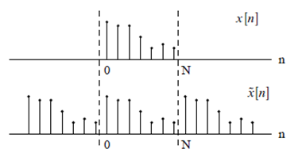

## Theory

                        

The discrete-time Fourier transform (DTFT) of a sequence is a continuous function of &omega;, and 
repeats with period 2&pi; 
In practice we usually want to obtain the Fourier components using digital computation, and can only evaluate them for
a discrete set of frequencies. The discrete Fourier transform (DFT) provides a means for achieving this .

 The DFT is itself a sequence, and it corresponds roughly to samples, equally spaced in frequency,
of the Fourier transform of the signal. The discrete Fourier transform of a length N signal x[n], n = 0, 1... N - 1 is given by
  
$$x[k]=\sum_{n=0}^{n-1}x[n]e^{-j(2 \frac{\pi}{N})kn}|$$

This is the analysis equation. The corresponding inverse equation is 

$$x[n]=\frac{1}{N} \sum_{n=0}^{n-1}x[k]e^{j(2 \frac{\pi}{N})kn}|$$

With this notation the DFT analysis-inverse pair becomes

$$W_N=e^{-j(2\frac{\pi}{N})}|$$

With this notation the DFT analysis-inverse pair becomes

$$x[k]=\sum_{n=0}^{n-1}x[n]w_n^{kn}|$$

$$x[n]=\frac{1}{N} \sum_{n=0}^{n-1}x[k]w_n^-{kn}|$$

An important property of the DFT is that it is cyclic, with period N, both in the discrete-time 
and discrete-frequency domains. For example, for any integer r

$$X[K+rN]=\sum_{n=0}^{n-1}x[n]w_N^{K+rN}.n=\sum_{n=0}^{n-1}W_N^{Kn}({W_N^N})^{rn}|$$

$$=\sum_{n=0}^{n-1}x[n]W_N^{Kn}=X[K],|$$

Since,

$$W N^N=e^{-j(2\frac{\pi}{N})N}=e^{-j2\pi}=1|$$

Similarly, it is easy to show that x[n + rN] = x[n], implying periodicity 
of the inverse equation. This is important - even though the DFT only depends on samples in the 
interval 0 to N - 1, it is implicitly assumed that the signals repeat with period N in both the time and
frequency domains.

To this end, it is sometimes useful to define the periodic extension of the signal X[n] to be
  
$$x[n]=x[n \ mod \ N]=x[((n))N]|$$

Here n mod N and((n))N are taken to mean n modulo N, which has the value of the remainder 
after n is divided by N.Alternatively, if n is written in the form n = kN + l for 0 &leq; l &leq; N, then

n mod N = ((n))N = l 

Similarly, the periodic extension of X[k] is defined to be

$$X[k]=X[k \ mod \ N]=X[((K))n]|$$

It is sometimes better to reason in terms of these periodic extensions when dealing with the DFT. 
Specifically, if X[k] is the DFT of x[n], then the inverse DFT of X[k] is [n]. The signals x[n] and [n] are identical 
over the interval 0 to N-1,but may differ outside of this range. Similar statements can be made regarding the 
transform X[k].

     
 
